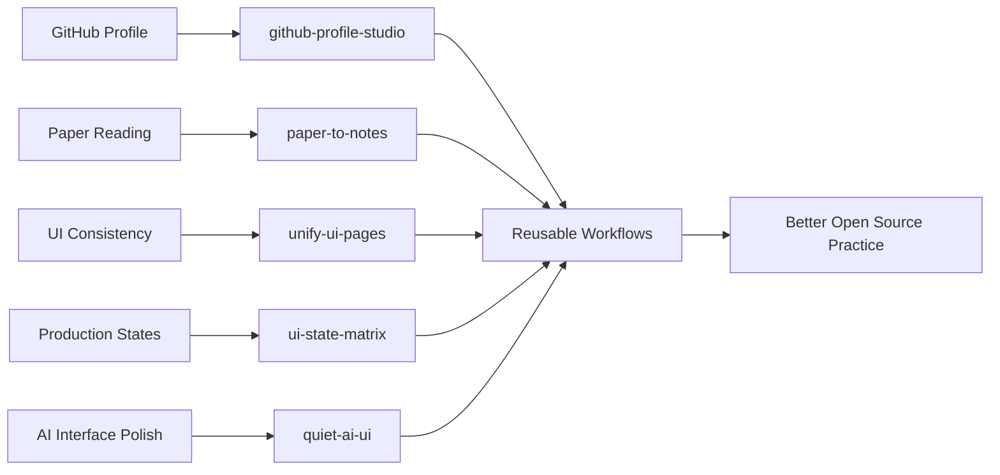

  

  

  
  
  
  

  <a href="#signal">Signal</a>
  ·
  <a href="#featured-systems">Featured Systems</a>
  ·
  <a href="#repository-universe">All Repositories</a>
  ·
  <a href="#skill-stack">Skill Stack</a>
  ·
  <a href="#next-builds">Next Builds</a>

 

## Signal

> Building a public lab for AI-assisted workflows, frontend systems, and practical tools.

<table>
  <tr>
    <td width="50%">
      <h3>Current Direction</h3>
      
I am turning small, repeatable workflows into Codex skills: research reading, UI consistency, production UI states, and AI-native interface polish.

    </td>
    <td width="50%">
      <h3>Design Taste</h3>
      
Clear hierarchy, low-noise visuals, useful automation, bilingual documentation, and product surfaces that feel calm enough to use every day.

    </td>
  </tr>
  <tr>
    <td width="50%">
      <h3>What I Am Practicing</h3>
      
GitHub hygiene, README-first project shaping, CLI workflows, AI tool design, frontend polish, and honest project iteration.

    </td>
    <td width="50%">
      <h3>Open Source Rule</h3>
      
Fewer throwaway demos. More useful skills, clearer examples, and visible learning traces.

    </td>
  </tr>
</table>

 

## Featured Systems

<table>
  <tr>
    <td colspan="2">
      <h3><a href="https://github.com/AuGa7/github-profile-studio-skill">github-profile-studio-skill</a></h3>
      
Generates polished tech-style GitHub profile READMEs from live public repository data, including a complete project index.

      

        
        
      

    </td>
  </tr>
  <tr>
    <td width="50%">
      <h3><a href="https://github.com/AuGa7/quiet-ai-ui-skill">quiet-ai-ui-skill</a></h3>
      
Apple-inspired, lightweight, low-AI-smell UI polishing for AI product interfaces.

      

        
        
      

    </td>
    <td width="50%">
      <h3><a href="https://github.com/AuGa7/ui-state-matrix-skill">ui-state-matrix-skill</a></h3>
      
Audits and implements loading, empty, error, disabled, focus, validation, and mobile states.

      

        
        
      

    </td>
  </tr>
  <tr>
    <td width="50%">
      <h3><a href="https://github.com/AuGa7/paper-to-notes-skill">paper-to-notes-skill</a></h3>
      
Turns research papers into structured notes, method breakdowns, comparison tables, and reproduction plans.

      

        
        
      

    </td>
    <td width="50%">
      <h3><a href="https://github.com/AuGa7/unify-ui-pages-skill">unify-ui-pages-skill</a></h3>
      
Extracts design specs from a main page and aligns subpages to one visual language.

      

        
        
      

    </td>
  </tr>
</table>

 

## Repository Universe

All current public repositories are listed here, including polished projects, prototypes, the profile repo, and learning traces.

| Repository | Type | Status | Stack | What it is |
| --- | --- | --- | --- | --- |
| [github-profile-studio-skill](https://github.com/AuGa7/github-profile-studio-skill) | Codex skill | Active | Python, Markdown | Generates polished tech-style GitHub profile READMEs with complete public repository coverage. |
| [quiet-ai-ui-skill](https://github.com/AuGa7/quiet-ai-ui-skill) | Codex skill | Active | Python, Markdown, CSS | AI product UI polishing: Apple-inspired, lightweight, low-AI-smell design workflow. |
| [ui-state-matrix-skill](https://github.com/AuGa7/ui-state-matrix-skill) | Codex skill | Active | Python, Markdown | Production UI state coverage for loading, empty, error, disabled, focus, validation, and responsive states. |
| [paper-to-notes-skill](https://github.com/AuGa7/paper-to-notes-skill) | Codex skill | Active | Python, Markdown | Research paper reading workflow with notes, method breakdowns, and reproduction plans. |
| [unify-ui-pages-skill](https://github.com/AuGa7/unify-ui-pages-skill) | Codex skill | Active | Markdown | UI consistency workflow for extracting page design specs and aligning subpages. |
| [ai-bible](https://github.com/AuGa7/ai-bible) | Prototype | Rebuild candidate | HTML, Node.js, Express | AI-assisted Bible study and reflection prototype. |
| [AuGa7](https://github.com/AuGa7/AuGa7) | Profile system | Active | Markdown | This GitHub profile README and public portfolio surface. |
| [ai-god](https://github.com/AuGa7/ai-god) | Early experiment | Needs rebuild | Planning | Early AI product experiment placeholder, kept as a learning trace before a clearer rebuild. |
| [fictional-goggles](https://github.com/AuGa7/fictional-goggles) | Learning notebook | Needs cleanup | Practice repo | Early GitHub learning notebook and practice repository. |

 

## Skill Stack

| Layer | I am building toward |
| --- | --- |
| Research | Turn long technical material into notes, decisions, and reproduction plans. |
| Interface | Make pages consistent, readable, responsive, and state-complete. |
| AI Product | Design AI-native flows with visible context, control, recovery, and less template noise. |
| Open Source | Keep repos understandable: clear README, examples, scripts, validation, and next steps. |

 

## GitHub Activity

  

  

 

## Next Builds

| Priority | Build |
| --- | --- |
| 1 | Use `github-profile-studio-skill` to keep this profile generated from live GitHub repo data. |
| 2 | Create a real before / after showcase for `quiet-ai-ui-skill` using an AI product screen. |
| 3 | Test `ui-state-matrix-skill` on a working frontend and add browser verification screenshots. |
| 4 | Add more bilingual paper examples to `paper-to-notes-skill`. |
| 5 | Rebuild or archive unclear early repositories so the public surface stays honest. |

 

  

