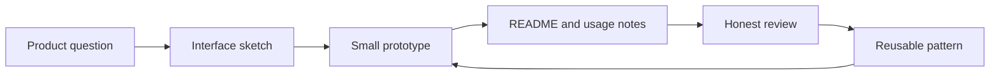

    

  

  
  
  

  <a href="#featured-work">Projects</a>
  ·
  <a href="#directory">目录</a>
  ·
  <a href="#featured-work">主打项目</a>
  ·
  <a href="#learning-map">学习地图</a>
  ·
  <a href="#next-milestones">下一步</a>

 

## 你好, 我是 au

这里是我的公开学习现场: 一部分是实验记录, 一部分是项目展架, 也有一部分是我从粗糙想法慢慢走向清晰系统的过程。

我现在最关注这几件事:

| 方向 | 我在探索什么 |
| --- | --- |
| AI-assisted building | 用 agents, prompts, skills 和工作流, 把想法变成可用的东西。 |
| Frontend craft | 让界面更清楚、更一致、更容易扫读。 |
| Product thinking | 在写代码之前, 先想清楚真实用户任务。 |
| Learning systems | 把学到的东西沉淀下来, 而不是让它们散掉。 |

> 当前信条: 保持好奇, 小步交付, 诚实复盘, 让进步看得见。

 

## 目录

| 板块 | 你会看到什么 |
| --- | --- |
| [个人快照](#snapshot) | 这个主页想表达什么。 |
| [主打项目](#featured-work) | 我希望你优先看到的公开仓库。 |
| [实验区](#experiments) | 早期原型、学习痕迹和还需要打磨的项目。 |
| [工具箱](#toolbox) | 我正在使用或学习的技术和工具。 |
| [学习地图](#learning-map) | 我给自己搭的成长路线。 |
| [GitHub 动态](#github-activity) | 公开统计和活动卡片。 |
| [下一步](#next-milestones) | 接下来会重点改进的事情。 |

 

## 个人快照

<table>
  <tr>
    <td width="50%">
      <h3>我想成为什么样的人</h3>
      
一个能把产品意图、AI 工具和界面质量连起来的 builder。现在还在早期, 但我希望自己的学习路径是可读、可复盘、可持续改进的。

    </td>
    <td width="50%">
      <h3>我看重什么</h3>
      
清楚的结构、真实的文档、有用的小工具, 以及稳定可见的进步。

    </td>
  </tr>
  <tr>
    <td width="50%">
      <h3>当前方向</h3>
      
Codex skills、AI 工作流设计、前端一致性、项目文档表达。

    </td>
    <td width="50%">
      <h3>主页状态</h3>
      
这个页面正在从简单学习记录, 慢慢整理成更清楚的项目作品集。

    </td>
  </tr>
</table>

 

## 主打项目

  
  

| 项目 | 它是什么 | 为什么值得看 |
| --- | --- | --- |
| `unify-ui-pages-skill` | 一个 Codex skill, 用来从主页面提取 UI 设计规范, 并把子页面统一到同一套视觉和交互语言下。 | 这是目前最完整的公开工具: 目标明确、有 README、有 license, 也体现了我对可复用工作流的兴趣。 |
| `ai-bible` | 一个 HTML 和 JavaScript 小项目, 尝试探索 AI 辅助的信仰与反思体验。 | 它记录了我早期把前端页面、Node 服务和 AI 产品想法连接起来的尝试。 |

 

## 实验区

不是所有东西都已经打磨完成。有些仓库暂时保留为学习痕迹、草稿或占位项目, 后续会继续整理。

| 仓库 | 当前状态 | 下一步整理 |
| --- | --- | --- |
| `fictional-goggles` | 早期学习记录。 | 提取有价值内容后重命名或归档。 |
| `ai-god` | 目前还是空的公开实验。 | 补上真实 README 和原型, 或者隐藏/归档。 |
| `profile README` | 当前 GitHub profile README。 | 持续优化结构、截图和项目导航。 |

 

## 工具箱

  
  
  
  
  
  
  
  
  

| 层级 | 工具和习惯 |
| --- | --- |
| Build | HTML, CSS, JavaScript, Node.js, Express. |
| Ship | Git, GitHub CLI, Vercel-oriented project structure. |
| Think | README-first planning, product notes, workflow documentation. |
| Improve | 小步迭代、可见 changelog、定期清理项目。 |

 

## 学习地图

| 路线 | 我正在练习 |
| --- | --- |
| AI workflow | Prompt 结构、agent skills、工具调用、复盘循环。 |
| Frontend | 布局、视觉层级、响应式细节、交互状态。 |
| Documentation | 清楚的 README、安装步骤、截图、项目意图。 |
| Engineering basics | Git hygiene、仓库结构、可重复的本地启动方式。 |

 

## GitHub 动态

| 公开节奏 | 当前状态 |
| --- | --- |
| Profile | 把首页整理成清楚、可信、可继续迭代的作品集。 |
| Projects | 优先打磨有 README、有 demo、有真实使用场景的仓库。 |
| Notes | 保留学习痕迹, 但会逐步清理不再代表当前方向的内容。 |
| Review | 定期回看项目表达: 名字、说明、截图、目录和下一步是否清楚。 |

 

## 下一步

| 优先级 | 行动 |
| --- | --- |
| 1 | 给 `unify-ui-pages-skill` 补更清楚的 examples 和 demo section。 |
| 2 | 修好 `ai-bible` 的项目结构, 让链接的 assets 和页面更完整。 |
| 3 | 归档或重建空仓库/不清晰仓库, 让 profile 更干净。 |
| 4 | 给可视化项目补截图和 live demo 链接。 |
| 5 | 保持月度学习记录, 让成长过程更容易被看到。 |

 

## 联系和链接

  
  

 

  

