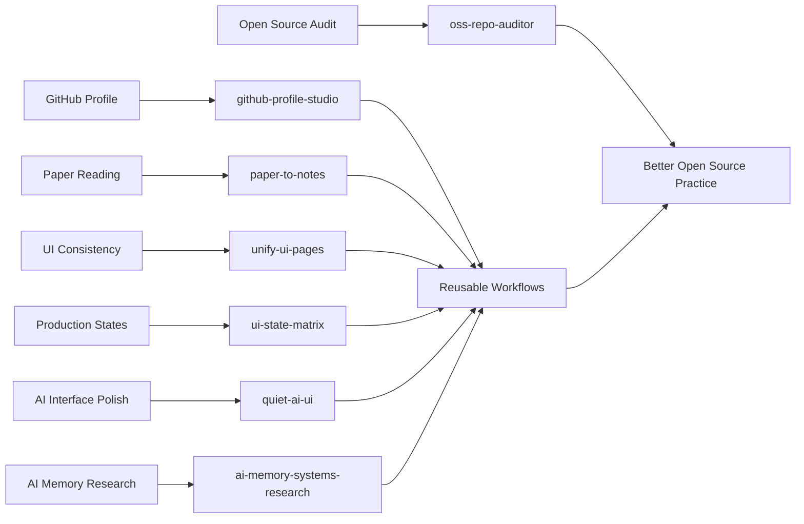

  

  

  
  
  
  
  

  <a href="#signal">身份信号</a>
  ·
  <a href="#mission-control">控制台</a>
  ·
  <a href="#ai-product-radar">AI 雷达</a>
  ·
  <a href="#featured-systems">主打系统</a>
  ·
  <a href="#repository-universe">项目星图</a>
  ·
  <a href="#next-builds">下一步</a>

 

## Signal

> 我是 au，一个 **AI Coding 探索者** 和 **AI 产品爱好者**。
> I explore AI coding, AI product workflows, and the interface systems that make intelligent tools actually usable.

我正在把自己对 AI 工具、产品体验、前端审美和开源表达的理解，沉淀成一组可复用的 Codex skills。这里不是简历墙，更像一个持续进化的公开实验室：有工具、有原型、有复盘，也有还没打磨完但诚实保留的学习痕迹。

 

## Mission Control

<table>
  <tr>
    <td width="50%">
      <h3>AI Coding 探索者</h3>
      
用 Codex、GitHub CLI、脚本和 README-first workflow，把模糊想法拆成可以运行、可以验证、可以复用的小系统。

    </td>
    <td width="50%">
      <h3>AI 产品爱好者</h3>
      
关注 AI 产品里的真实体验：上下文、控制感、失败恢复、界面状态、信息层级，以及低噪声的产品质感。

    </td>
  </tr>
  <tr>
    <td width="50%">
      <h3>Codex Skill Builder</h3>
      
把论文阅读、UI 统一、状态审计、AI 界面美化、GitHub profile 生成等流程做成可分享的 skills。

    </td>
    <td width="50%">
      <h3>公开学习现场</h3>
      
不追求一夜完美，更看重持续迭代：少一点无效 demo，多一点真实场景、清楚文档和可见进步。

    </td>
  </tr>
</table>

 

## AI Product Radar

<table>
  <tr>
    <td width="25%" align="center">
      <h3>Agent Workflow</h3>
      
把复杂任务拆成可执行步骤，让 AI 不只是聊天，而是能做事。

      
    </td>
    <td width="25%" align="center">
      <h3>AI Coding</h3>
      
用 CLI、脚本、测试和 GitHub 工作流，把想法快速落地并公开验证。

      
    </td>
    <td width="25%" align="center">
      <h3>AI Product UX</h3>
      
关注上下文、可控性、错误恢复、状态反馈和低 AI 味界面。

      
    </td>
    <td width="25%" align="center">
      <h3>Open Source</h3>
      
用 README、showcase、脚本和真实边界，让项目更容易被理解。

      
    </td>
  </tr>
</table>

 

## 主打系统 / Featured Systems

<table>
  <tr>
    <td colspan="2">
      <h3><a href="https://github.com/AuGa7/ai-memory-systems-research">ai-memory-systems-research</a></h3>
      
Medium-depth GitHub research notes on AI agent memory systems, with a Chinese report, 65-project index, and reusable search script.

      

        
        
        
      

    </td>
  </tr>
  <tr>
    <td colspan="2">
      <h3><a href="https://github.com/AuGa7/oss-repo-auditor">oss-repo-auditor</a></h3>
      
No-dependency CLI for checking README quality, license presence, repository hygiene, leak-risk signals, and release readiness before open-sourcing a project.

      

        
        
        
      

    </td>
  </tr>
  <tr>
    <td colspan="2">
      <h3><a href="https://github.com/AuGa7/github-profile-studio-skill">github-profile-studio-skill</a></h3>
      
Generates polished tech-style GitHub profile READMEs from live public repository data, including a complete project index.

      

        
        
      

    </td>
  </tr>
  <tr>
    <td width="50%">
      <h3><a href="https://github.com/AuGa7/quiet-ai-ui-skill">quiet-ai-ui-skill</a></h3>
      
Apple-inspired, lightweight, low-AI-smell UI polishing for AI product interfaces.

      

        
        
      

    </td>
    <td width="50%">
      <h3><a href="https://github.com/AuGa7/ui-state-matrix-skill">ui-state-matrix-skill</a></h3>
      
Audits and implements loading, empty, error, disabled, focus, validation, and mobile states.

      

        
        
      

    </td>
  </tr>
  <tr>
    <td width="50%">
      <h3><a href="https://github.com/AuGa7/paper-to-notes-skill">paper-to-notes-skill</a></h3>
      
Turns research papers into structured notes, method breakdowns, comparison tables, and reproduction plans.

      

        
        
      

    </td>
    <td width="50%">
      <h3><a href="https://github.com/AuGa7/unify-ui-pages-skill">unify-ui-pages-skill</a></h3>
      
Extracts design specs from a main page and aligns subpages to one visual language.

      

        
        
      

    </td>
  </tr>
</table>

 

## 项目星图 / Repository Universe

这里列出所有当前公开仓库，包括成熟项目、技能库、原型、profile 仓库和早期学习痕迹。好项目放在台前，未完成的也诚实标注状态。

| Repository | Type | Status | Stack | What it is |
| --- | --- | --- | --- | --- |
| [ai-memory-systems-research](https://github.com/AuGa7/ai-memory-systems-research) | Research notes | Active | Markdown, CSV, Python | Medium-depth GitHub research map for AI agent memory systems, with project index and implementation takeaways. |
| [oss-repo-auditor](https://github.com/AuGa7/oss-repo-auditor) | Open-source CLI | Active | Python, Markdown | Audits README quality, license presence, repository hygiene, leak-risk signals, and release readiness before publishing. |
| [github-profile-studio-skill](https://github.com/AuGa7/github-profile-studio-skill) | Codex skill | Active | Python, Markdown | Generates polished tech-style GitHub profile READMEs with complete public repository coverage. |
| [quiet-ai-ui-skill](https://github.com/AuGa7/quiet-ai-ui-skill) | Codex skill | Active | Python, Markdown, CSS | AI product UI polishing: Apple-inspired, lightweight, low-AI-smell design workflow. |
| [ui-state-matrix-skill](https://github.com/AuGa7/ui-state-matrix-skill) | Codex skill | Active | Python, Markdown | Production UI state coverage for loading, empty, error, disabled, focus, validation, and responsive states. |
| [paper-to-notes-skill](https://github.com/AuGa7/paper-to-notes-skill) | Codex skill | Active | Python, Markdown | Research paper reading workflow with notes, method breakdowns, and reproduction plans. |
| [unify-ui-pages-skill](https://github.com/AuGa7/unify-ui-pages-skill) | Codex skill | Active | Markdown | UI consistency workflow for extracting page design specs and aligning subpages. |
| [ai-bible](https://github.com/AuGa7/ai-bible) | Prototype | Rebuild candidate | HTML, Node.js, Express | AI-assisted Bible study and reflection prototype. |
| [AuGa7](https://github.com/AuGa7/AuGa7) | Profile system | Active | Markdown | This GitHub profile README and public portfolio surface. |
| [ai-god](https://github.com/AuGa7/ai-god) | Early experiment | Needs rebuild | Planning | Early AI product experiment placeholder, kept as a learning trace before a clearer rebuild. |
| [fictional-goggles](https://github.com/AuGa7/fictional-goggles) | Learning notebook | Needs cleanup | Practice repo | Early GitHub learning notebook and practice repository. |

 

## 能力轨道 / Skill Stack

| Layer | I am building toward |
| --- | --- |
| Research | Turn long technical material into notes, decisions, and reproduction plans. |
| Interface | Make pages consistent, readable, responsive, and state-complete. |
| AI Product | Design AI-native flows with visible context, control, recovery, and less template noise. |
| Open Source | Keep repos understandable: clear README, examples, scripts, validation, and next steps. |

 

## GitHub 动态 / Activity

  

  

  

 

## 下一步 / Next Builds

| Priority | Build |
| --- | --- |
| 1 | Turn `ai-memory-systems-research` into concrete memory-system prototypes and eval ideas. |
| 2 | Use `oss-repo-auditor` before publishing new public projects, then turn the best checks into a GitHub Action. |
| 3 | Use `github-profile-studio-skill` to keep this profile generated from live GitHub repo data. |
| 4 | Create a real before / after showcase for `quiet-ai-ui-skill` using an AI product screen. |
| 5 | Rebuild or archive unclear early repositories so the public surface stays honest. |

 

  

